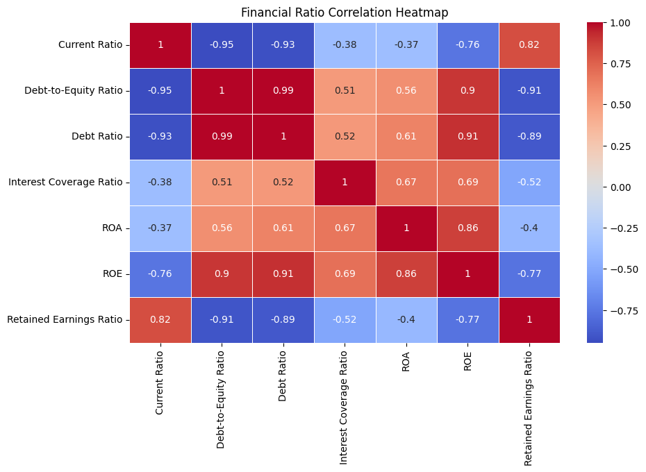

# Altman Z-Score Analysis Workflow

## Overview
This project documents the workflow for calculating and analyzing the **Altman Z-Score** for **Reliance Industries Limited** using the **Google Data Analytics Process (APPASA)**.

## 1. **Ask**
**Objective:** Assess the financial health and bankruptcy risk of **Reliance Industries Limited** using the **Altman Z-Score for Emerging Markets**.

## 2. **Prepare**
**Data Source:** Reliance Industries Limited's **Annual Report** (Balance Sheet & Income Statement) from 2015 march to 2024 march
**Extracted File:**
- `extracted_data.csv` → Contains raw financial data extracted from the annual report.

## 3. **Process**
### Data Cleaning:
- Cleaned `extracted_data.csv` → Saved as `clean_re_extracted_data.csv`.

### Calculations:
- **Altman Z-Score Calculation**
  - Used `clean_re_extracted_data.csv`.
  - Saved the computed Z-Score in `re_alt_zscore.csv`.

- **Financial Ratio Calculation**
  - Derived key financial ratios from `clean_re_extracted_data.csv`.
  - Saved output as `financial_ratios.csv`.

## 4. **Analyze**
### Key Analyses:
- **Altman Z-Score Trend:**
  - Used `re_alt_zscore.csv` for trend visualization.

- **Financial Ratios Trend:**
  - Used `financial_ratios.csv` for financial ratio visualizations.

- **Correlation Matrix:**
  - Used `financial_ratios.csv` to analyze relationships between financial metrics.

## 5. **Share**

#### Financial Ratio Correlation Heatmap

- **Strong Negative Correlations:**
  - Debt-to-Equity Ratio and Current Ratio (-0.95) → Higher leverage is associated with lower liquidity.
  - ROE and Retained Earnings Ratio (-0.77) → High ROE often means more distributed profits, reducing retained earnings.

- **Strong Positive Correlations:**
  - Debt Ratio and Debt-to-Equity Ratio (0.99) → Highly leveraged companies tend to have high debt ratios.
  - ROE and ROA (0.86) → Return on equity is strongly linked to return on assets.

#### Financial Ratios Trend Over Time

- **Declining Leverage:**
  - Debt-to-Equity and Debt Ratios show a downward trend, suggesting Reliance Industries has been reducing its reliance on debt financing.

- **Increasing Retained Earnings:**
  - The sharp upward movement in retained earnings from 2020 suggests improved profitability and reinvestment strategies.

- **Fluctuating ROE & ROA:**
  - ROE peaked in 2017-2019 but dropped post-2020, likely due to capital restructuring or lower net income margins.

#### Altman Z''-Score Trend Over 10 Years

- **Distress Zone (Pre-2020):**
  - The company was in financial distress (Z'' < 1.1) from 2016-2019.

- **Sharp Recovery Post-2020:**
  - Z'' spiked to 2.96 in 2021, pushing the company into the Grey Zone, indicating improved financial stability.

- **Sustained but Volatile Recovery:**
  - 2022-2024 values hover near the Grey/Safe Zone boundary, meaning continued improvements but with some instability.

#### Conclusion
- **Debt Reduction & Profit Retention:** The company appears to be shifting from high leverage to a more sustainable capital structure.
- **Financial Recovery Post-2020:** There was a significant financial turnaround, lifting the company from distress.
- **Cautious Optimism:** While improvements are evident, volatility remains in profitability and financial stability.

This documentation provides an in-depth financial assessment, leveraging Altman Z''-Score and ratio analysis for evaluating corporate financial health.

## 6. **Act**
- Insights from the analysis will help in making informed investment decisions regarding Reliance Industries Limited.

---

### Further Analysis
- Further refine financial metric selection.
- Explore sectoral comparisons using the Altman Z-Score.
- Implement predictive modeling for financial distress analysis.
