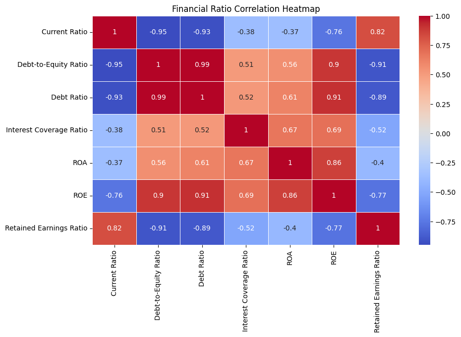
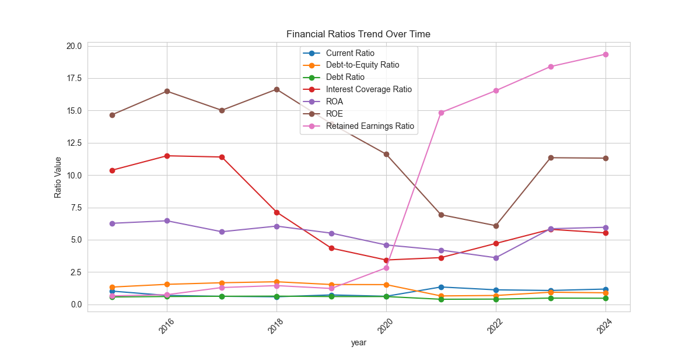
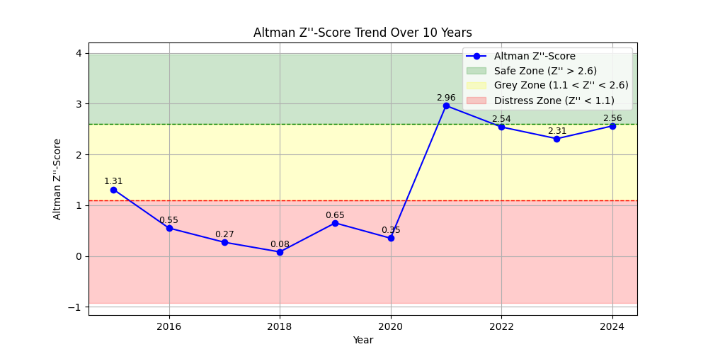

# Altman Z-Score Analysis Workflow

## Overview
This study evaluates the financial health of Reliance Industries Limited (RIL) using the **Altman Z''-Score for Emerging Markets (1995 Model)**. Since India is an emerging market and Reliance is a well-diversified company, this model is the most appropriate for assessing its bankruptcy risk.
A 10-year financial dataset was analyzed to track the Z''-Score trend, offering insights into Reliance's financial stability and performance. The analysis prioritizes accuracy over automation, using financial data directly from the company’s balance sheet and income statement.

**_NOTE_:** Refer [financial concepts](info/financial_concept.md) to better understand the case study.
## 1. **Ask**
**Objective:** Assess the financial health and bankruptcy risk of **Reliance Industries Limited** using the **Altman Z-Score for Emerging Markets** using the **Google Data Analytics Process (APPASA)**.

## 2. **Prepare**
Data Source: Reliance Industries' Balance Sheet & Income Statement (Direct extraction for accuracy).
Timeframe: 10 years of financial data, 2015 march to 2024 march.
**Extracted File:**
- Extracted and [combed data](data/extracted_Data.csv) from [financial statement](data/financial_statements) → Contains raw financial data extracted from the annual report: total_non_current_assets,	total_current_assets,	total_assets,	total_non_current_liabilities,	total_current_liabilities,	total_liabilities,	retained_earnings,	profit_before_tax,	finance_cost,	ebit, book_value_of_equity.

## 3. **Process**
### Data Cleaning:
- Extracted and [combed data](data/extracted_Data.csv) → Saved as Reliance industries Limited [cleaned data](data/cleaned_re_extracted_data.csv)
- Convert 'year' column to datetime format, remove duplicate, remove NaN row.

###### _**Code:** [Data Cleaning](code/datacleaning_RE.py)_

### Calculations:
- **Altman Z-Score Calculation**
  - Used [cleaned data](data/cleaned_re_extracted_data.csv).
  - **Z′′=6.56(X₁) + 3.26(X₂) + 6.72(X₃) + 1.05(X₄)**
    
    where,
    -	**X₁** = Liquidity → (Working Capital / Total Assets)
    -	**X₂** = Profitability → (Retained Earnings / Total Assets)
    -	**X₃** = Operating Efficiency → (EBIT / Total Assets)
    -	**X₄** = Leverage & Solvency → (Book Value of Equity / Total Liabilities)

  - Saved the computed Z-Score in [Z score data](data/re_alt_zscore.csv)
    
###### _**Code:** [Altman Z Score](code/Alt_zscore_em.py)_

- **Financial Ratio Calculation**
  - Derived key financial ratios such as: **_Current Ratio, Debt-to-Equity Ratio, Debt Ratio, Interest Coverage Ratio, ROA, ROE, Retained Earnings Ratio_** from [cleaned data](data/cleaned_re_extracted_data.csv).
  - Saved output as [financial ratio](data/financial_ratios.csv) data.
    
###### _**Code:** [Financial Ratio](code/fratio_viz.py)_

## 4. **Analyze**
### Key Analyses:
- **Altman Z-Score Trend:**
  - Used [Z score data](data/re_alt_zscore.csv) for trend visualization.
    
###### _**Code:** [Z score data](code/alt_zcore_em_viz.py)_

- **Financial Ratios Trend:**
  - Used [financial ratio](data/financial_ratios.csv) for financial ratio visualizations.
    
###### _**Code:** [financial ratio trend](code/fratio_viz.py)_

- **Correlation Matrix:**
  - Used [financial ratio](data/financial_ratios.csv) to analyze relationships between financial metrics.
    
###### _**Code:** [Correlation](code/correlation_matrices.py)_

## 5. **Share**

#### Financial Ratio Correlation Heatmap

- **Strong Negative Correlations:**
  - Debt-to-Equity Ratio and Current Ratio (-0.95) → Higher leverage is associated with lower liquidity.
  - ROE and Retained Earnings Ratio (-0.77) → High ROE often means more distributed profits, reducing retained earnings.

- **Strong Positive Correlations:**
  - Debt Ratio and Debt-to-Equity Ratio (0.99) → Highly leveraged companies tend to have high debt ratios.
  - ROE and ROA (0.86) → Return on equity is strongly linked to return on assets.

#### Financial Ratios Trend Over Time

- **Declining Leverage:**
  - Debt-to-Equity and Debt Ratios show a downward trend, suggesting Reliance Industries has been reducing its reliance on debt financing.

- **Increasing Retained Earnings:**
  - The sharp upward movement in retained earnings from 2020 suggests improved profitability and reinvestment strategies.

- **Fluctuating ROE & ROA:**
  - ROE peaked in 2017-2019 but dropped post-2020, likely due to capital restructuring or lower net income margins.

#### Altman Z''-Score Trend Over 10 Years

- **Distress Zone (Pre-2020):**
  - The company was in financial distress (Z'' < 1.1) from 2016-2020.

- **Sharp Recovery Post-2020:**
  - Z'' spiked to 2.96 in 2021, pushing the company into the Grey Zone, indicating improved financial stability.

- **Sustained but Volatile Recovery:**
  - 2022-2024 values hover near the Grey/Safe Zone boundary, meaning continued improvements but with some instability.

#### Conclusion
- **Debt Reduction & Profit Retention:** The company appears to be shifting from high leverage to a more sustainable capital structure.
- **Financial Recovery Post-2020:** There was a significant financial turnaround, lifting the company from distress.
- **Cautious Optimism:** While improvements are evident, volatility remains in profitability and financial stability.

This documentation provides an in-depth financial assessment, leveraging Altman Z''-Score and ratio analysis for evaluating corporate financial health.

## 6. **Act**
- Insights from the analysis will help in making informed investment decisions regarding Reliance Industries Limited.

---

### Further Analysis
- Further refine financial metric selection.
- Explore sectoral comparisons using the Altman Z-Score.
- Implement predictive modeling for financial distress analysis.
